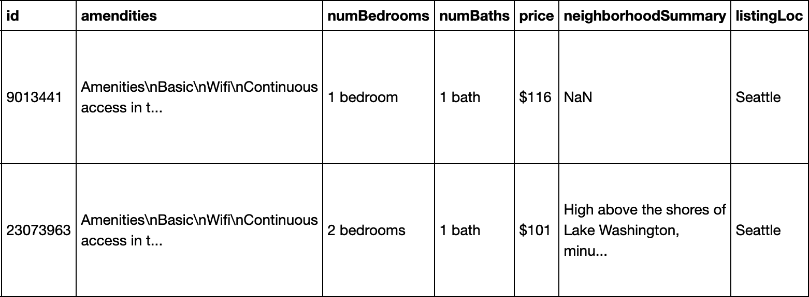
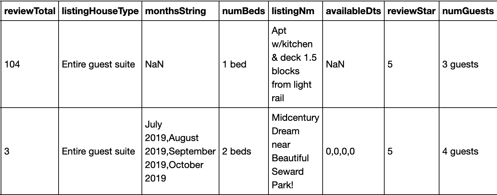

## Main Goals

I would like to one day become an Airbnb Host as a side job. This project is trying to know more about the Airbnb Housing Listings in Seattle area, and answer questions like:

- What categories of Housing Listings is now available in Seattle, in terms of various listing features, like entire house or private room, number of rooms?
- What price I can set based on different criterions of the House
- What feature will affect the popularity of the listing
- What feature does people care the most when choosing an Airbnb Housing

## Main Process
### Web Scrapping using `BeautifulSoup`, `selenium`
- Step 1: Get the URL for **3000** Housing Listings in greater Seattle area<br/>
  (Script: 001_Get_Housing_Listing_URL.ipynb)

  Airbnb only return 17 pages per search, to scrape enough listings, I scrapped by price range from 50 to 200. Perform 1 search for each $5 bucket, and get the listings from all the pages returned by the search.

  Note that due to the scrapping technique, this sample won't be a good representation of the whole housing listing population, but it should give us a reasonable look of housing listings in the price range selected.

- Step 2: Get the listing details for all 3000 Housing Listings<br/>
  (Script: 002_Get_Individual_Listing_Details.ipynb)

  Below is a list of informations scrapped for each listing:
  - Name
  - Location
  - Housing Type(Entire House/Private Room etc)
  - Number of Guests/Bedrooms/Beds/Baths
  - **Available Dates for the Next 3 Month**
  - Number of Reviews
  - Overall Review Level
  - Neighborhood Summary
  - Price
  - **Full Amenity List**

  Scrapping Available Dates and Full Amenity List is trickier than the others

  To get available dates, I have looped through all the `dates td tag` for each `month table` in the `calendar div`, counted all the dates with `aria-label` not starts with `Not`

  The full amenity list is implemented as pop-up **Modal**, I have used `selenium` to click the `Show all 18 amenities` button<br/>
  <br/>

  ```
  element = driver.find_element_by_css_selector('div#amenities button')
  webdriver.ActionChains(driver).move_to_element(element).click(element).perform()
  ```

  The scrapping of each individual element is wrapped in `try-except` block to handle listing variations

- Below is scrapped results in `csv` format<br/>
<br/><br/><br/>
<br/><br/>

### Data Cleaning & Freq Table using `pandas`, `numpy`<br/>
(Script: 003_import_clean_individual_listings.ipynb)

- There are ~30 different housing type, grouped similar types
- Converted Number of Rooms/Baths/Beds/Guests/Reviews, Price, Ratings into Numerical type
- Created Private/Shared Bath flag
- Separated available dates into 3 individual columns, represent dates for Aug, Sep, Oct
- Removed additional comments in Amenity Listing
- Separated Amenity Listing into Subgroups, including: Basic, Family, Facilities, Not Have etc.

## Coming Soon
### Visualization for various Housing Features using `Dash`

### Fill in more specific location information
90% of the Listing Location is in Seattle, more specific location information needs to be added potentially through texting mining using the Listing Name, Neighborhood Summary

### Cluster listings to see the main Housing Listing Type Options

### Predict Listing Price, Identify Key Feature affecting Price

### Predict Listing Popularity, Identify Key Feature affecting Popularity

### Identify Key Feature by Text Mining Reviews
